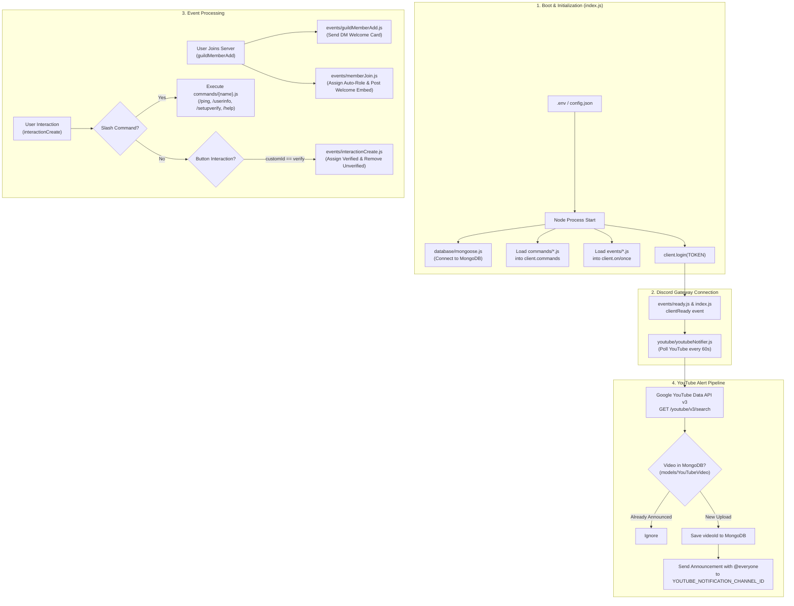

# Project Walkthrough: GYRORISHABH Discord Bot

This document explains the current inner workings, execution flow, component relationships, and key files of the GYRORISHABH Discord Bot.

---

## 🗺 System Architecture Flow

The following diagram illustrates how the bot initializes, interacts with Discord Gateway and external services, and responds to events:

---

## 🔍 Detailed Component Walkthrough

### 1. Application Entry Point (`index.js`)

The bot begins execution in `index.js`:
1. **Environment Configuration:** Reads `.env` via `dotenv.config()`.
2. **Database Initialization:** Invokes `connectDB()` from `database/mongoose.js` to establish an asynchronous connection to MongoDB Atlas.
3. **Discord Client Instantiation:** Instantiates `Client` with required `GatewayIntentBits` (`Guilds`, `GuildMessages`, `MessageContent`, `GuildMembers`, `GuildVoiceStates`).
4. **Command Autoloading:** Reads all `.js` files from `commands/` and stores them in a `client.commands` Map/Collection.
5. **Event Autoloading:** Reads all `.js` files from `events/` and binds them to `client.on(...)` or `client.once(...)` based on the exported `event.once` flag.
6. **Ready Listener & YouTube Service:** Attaches a `clientReady` listener that triggers `youtubeNotifier(client)`.
7. **Login:** Executes `client.login(process.env.TOKEN)` to establish the WebSocket gateway session with Discord.

---

### 2. Database Connection & Schema (`database/mongoose.js` & `models/YouTubeVideo.js`)

- **`database/mongoose.js`:**
  - Connects to MongoDB using `process.env.MONGODB_URI`.
  - Exits process (`process.exit(1)`) if the initial connection fails.
- **`models/YouTubeVideo.js`:**
  - Defines the Mongoose schema storing announced videos:
    - `videoId` (`String`, `unique: true`): YouTube video identifier.
    - `type` (`String`, enum: `["video", "live", "short"]`).
    - `createdAt` (`Date`, default: `Date.now`).
  - Ensures each video is stored once so duplicates are not repeatedly posted.

---

### 3. Event Handling Pipeline (`events/`)

#### A. Startup (`events/ready.js`)
- Listens for `clientReady` once.
- Logs confirmation that the bot user is connected (`✅ <tag> is online!`).

#### B. Member Join Pipeline (`events/guildMemberAdd.js` & `events/memberJoin.js`)
When a user joins the Discord guild, Discord emits the `guildMemberAdd` event. Currently, two files handle this event:
- **`events/guildMemberAdd.js`:**
  - Creates a direct message (DM) embed welcoming the user by username (`${member.user.username}`).
  - Adds 3 link buttons via `ActionRowBuilder`:
    1. **Verify Server** (Link to Discord invite)
    2. **YouTube** (Link to `@GYRORISHABH`)
    3. **Instagram** (Link to Instagram profile)
  - Dispatches `member.send({ embeds, components })`. Uses a `try/catch` block to handle cases where users disable server DMs.
- **`events/memberJoin.js`:**
  - Resolves `config.AUTO_ROLE_ID` from the guild's role cache and assigns it to `member.roles.add(role)`.
  - Resolves `config.WELCOME_CHANNEL_ID` and posts a welcome embed displaying the member's avatar, mention, and server member position (`Member #${member.guild.memberCount}`).

#### C. Interaction Routing (`events/interactionCreate.js`)
This event handles user actions in the Discord UI:
- **Slash Commands (`interaction.isChatInputCommand()`):**
  - Looks up the command in `interaction.client.commands`.
  - Calls `command.execute(interaction)`.
  - Catches execution exceptions and responds with an error message (ephemeral or editReply).
- **Button Clicks (`interaction.isButton()`):**
  - Detects buttons with `customId === "verify"`.
  - Finds roles by name: `"verified"`, `"Member"`, and `"Unverified"`.
  - Adds `verifiedRole` and `memberRole` to the user and removes `unverifiedRole`.
  - Replies with an ephemeral confirmation message.

---

### 4. Verification Standalone Logic (`buttons/verify.js` & `commands/setupverify.js`)

- **`commands/setupverify.js`:**
  - Administrator command that sends a persistent verification embed into the current channel.
  - Attaches a green button with `setCustomId("verify")` and label `"Verify"`.
- **`buttons/verify.js`:**
  - Contains role-ID-based logic using `config.MEMBER_ROLE_ID` and `config.UNVERIFIED_ROLE_ID`.
  - Checks if the user already has the member role before modifying roles.
  - *(Note: Currently, `events/interactionCreate.js` executes its own inline button logic rather than calling this file; the implementation plan addresses unifying this).*

---

### 5. YouTube Video Poller (`youtube/youtubeNotifier.js`)

- Operates on a 60,000ms (1 minute) interval.
- Issues an HTTP GET request to `https://www.googleapis.com/youtube/v3/search` using Axios with:
  - `key`: Google API Key
  - `channelId`: Target channel ID
  - `part`: `"snippet"`
  - `order`: `"date"`
  - `maxResults`: 3
  - `type`: `"video"`
- Loops through returned items:
  1. Checks if the `videoId` already exists in MongoDB (`YouTubeVideo.findOne({ videoId })`).
  2. If missing, saves the video in MongoDB (`YouTubeVideo.create({ videoId, type: "video" })`).
  3. Fetches `config.YOUTUBE_NOTIFICATION_CHANNEL_ID` from the Discord client cache.
  4. Posts an announcement message tagging `@everyone` with the video link (`https://youtu.be/${videoId}`).

---

### 6. Command Registration (`deploy-commands.js`)

- Reads all command files inside `commands/`.
- Converts each command's `SlashCommandBuilder` data to JSON.
- Uses Discord REST API v10 to register commands to the specific guild via `Routes.applicationGuildCommands(CLIENT_ID, GUILD_ID)`.
- Guild command deployment takes effect immediately without global caching delays.
